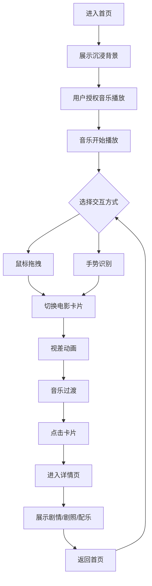

## 1. 产品概述
宫崎骏电影主题网站是一个沉浸式、浪漫的视觉体验平台，展示吉卜力工作室经典电影作品，融合久石让经典配乐，支持手势交互浏览。

- 核心目的：为宫崎骏/吉卜力影迷提供沉浸式电影探索体验
- 目标用户：动漫爱好者、电影爱好者、艺术设计爱好者
- 市场价值：打造全球最具艺术感的吉卜力电影主题网站

## 2. 核心功能

### 2.1 用户角色
| 角色 | 注册方式 | 核心权限 |
|------|----------|----------|
| 访客 | 无需注册 | 浏览电影、体验交互、播放音乐 |

### 2.2 功能模块
1. **首屏沉浸页**：全屏动态背景、音乐播放器、手势导航入口
2. **电影展示模块**：电影卡片网格、拖拽切换、手势控制
3. **电影详情页**：剧情介绍、剧照轮播、配乐信息
4. **音乐播放器**：久石让经典配乐播放、音乐过渡效果

### 2.3 页面详情
| 页面名称 | 模块名称 | 功能描述 |
|----------|----------|----------|
| 首页 | Hero沉浸区 | 全屏动态水彩背景、音乐播放控制、电影卡片入口 |
| 首页 | 电影卡片区 | 电影卡片网格展示、鼠标拖拽切换、手势识别切换 |
| 详情页 | 电影信息区 | 电影海报、标题、年份、剧情简介 |
| 详情页 | 剧照轮播 | 经典剧照自动轮播、手势切换 |
| 详情页 | 配乐信息 | 配乐名称、作曲家信息、播放控制 |

## 3. 核心流程

## 4. 用户界面设计

### 4.1 设计风格
- **主色调**：吉卜力标志性柔和水彩风格
  - 天空蓝：#87CEEB
  - 草地绿：#98D8C8
  - 夕阳橙：#F7DC6F
  - 梦幻紫：#D7BDE2
  - 温暖棕：#D4A574
- **按钮风格**：圆角、水彩渐变、手绘风格边框
- **字体**：优雅衬线字体（Playfair Display）搭配手写风格字体
- **布局风格**：卡片式布局，宽松留白，有机曲线
- **装饰元素**：手绘云朵、星星、树叶等吉卜力风格装饰

### 4.2 页面设计概述

| 页面名称 | 模块名称 | UI元素 |
|----------|----------|--------|
| 首页 | Hero沉浸区 | 全屏动态水彩渐变背景、漂浮动画元素、音乐控制按钮、电影标题叠加 |
| 首页 | 电影卡片区 | 圆角卡片、电影封面图、标题/年份标签、悬停缩放效果、拖拽指示 |
| 详情页 | 电影信息区 | 大尺寸海报、艺术字体标题、柔和阴影、留白布局 |
| 详情页 | 剧照轮播 | 全屏剧照、渐变遮罩、左右手势指示、平滑过渡动画 |
| 详情页 | 配乐信息 | 音乐波形可视化、播放控制、配乐名称/作曲家信息 |

### 4.3 响应式设计
- **桌面端**：1200px+，三列卡片网格，完整手势交互
- **平板端**：768px-1199px，两列卡片网格，简化手势
- **移动端**：<768px，单列卡片，触摸滑动切换，音乐控制优化

### 4.4 交互设计
- **鼠标拖拽**：按住卡片左右拖拽切换，触发视差滚动效果
- **手势识别**：通过摄像头识别左右挥手动作切换卡片
- **音乐过渡**：切换电影时音乐平滑淡入淡出
- **视差动画**：背景元素随卡片切换产生层次位移
