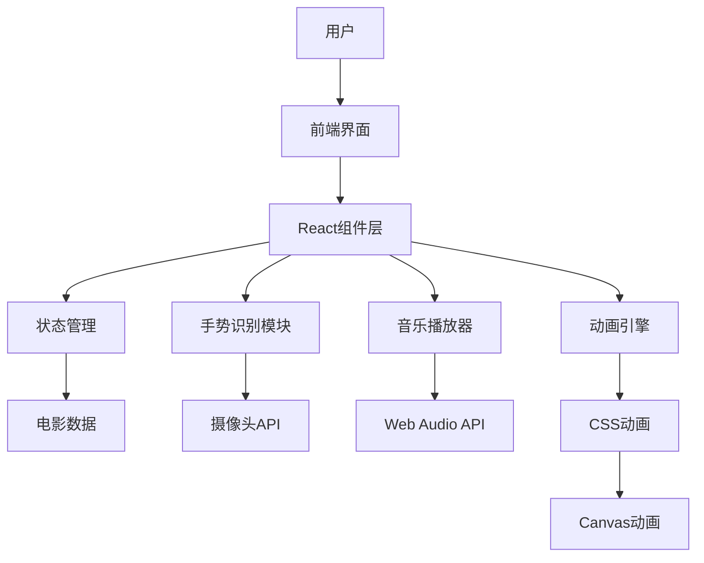
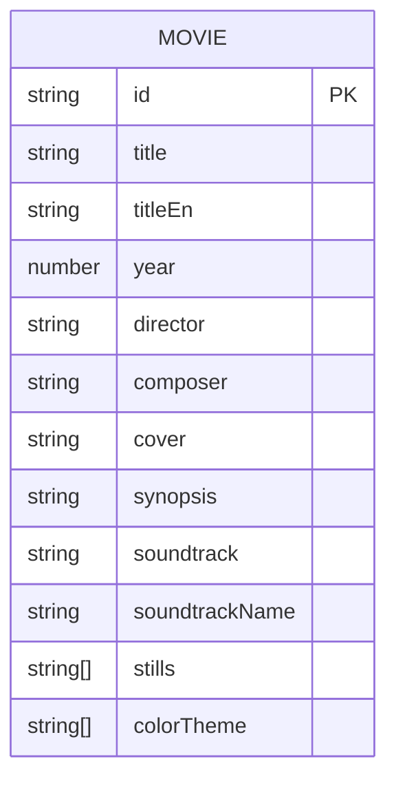

## 1. 架构设计



## 2. 技术描述

* **前端框架**：React\@18 + TypeScript + Vite\@6

* **样式方案**：TailwindCSS\@3 + 自定义CSS动画

* **状态管理**：Zustand

* **手势识别**：MediaPipe Hands API + Web Camera API

* **音乐播放**：Web Audio API + Howler.js

* **路由**：React Router DOM\@6

* **图标**：Lucide React

## 3. 路由定义

| 路由         | 用途                     | 组件              |
| ---------- | ---------------------- | --------------- |
| /          | 首页，沉浸式Hero + 电影卡片展示    | Home.tsx        |
| /movie/:id | 电影详情页，剧情介绍 + 剧照轮播 + 配乐 | MovieDetail.tsx |

## 4. API定义

### 4.1 电影数据接口（静态数据）

```typescript
interface Movie {
  id: string;
  title: string;
  titleEn: string;
  year: number;
  director: string;
  composer: string;
  cover: string;
  synopsis: string;
  soundtrack: string;
  soundtrackName: string;
  stills: string[];
  colorTheme: string[];
}
```

### 4.2 音乐播放器接口

```typescript
interface AudioPlayer {
  play: (url: string) => void;
  pause: () => void;
  stop: () => void;
  fadeIn: (duration: number) => void;
  fadeOut: (duration: number) => void;
  currentTime: number;
  duration: number;
  isPlaying: boolean;
}
```

## 5. 数据模型

### 5.1 电影数据模型



### 5.2 初始数据集

包含10部吉卜力经典电影：

1. 天空之城 (1986)
2. 龙猫 (1988)
3. 魔女宅急便 (1989)
4. 红猪 (1992)
5. 幽灵公主 (1997)
6. 千与千寻 (2001)
7. 哈尔的移动城堡 (2004)
8. 悬崖上的金鱼姬 (2008)
9. 起风了 (2013)

## 6. 项目结构

```
src/
├── components/
│   ├── HeroSection.tsx        # 沉浸首页区域
│   ├── MovieCard.tsx          # 电影卡片组件
│   ├── MovieGrid.tsx          # 电影卡片网格
│   ├── GestureControl.tsx     # 手势控制组件
│   ├── AudioPlayer.tsx        # 音乐播放器
│   ├── ParallaxBackground.tsx # 视差背景
│   └── NavBar.tsx             # 导航栏
├── pages/
│   ├── Home.tsx               # 首页
│   └── MovieDetail.tsx        # 电影详情页
├── hooks/
│   ├── useGestureControl.ts   # 手势识别hook
│   ├── useAudioPlayer.ts      # 音乐播放hook
│   └── useParallax.ts        # 视差效果hook
├── data/
│   └── movies.ts              # 电影数据
├── store/
│   └── appStore.ts            # 全局状态管理
├── styles/
│   ├── globals.css            # 全局样式
│   └── animations.css         # 自定义动画
├── App.tsx
├── main.tsx
└── index.css
```

## 7. 核心技术实现

### 7.1 手势识别

* 使用MediaPipe Hands API识别手部关键点

* 通过计算手腕位置变化判断左右滑动

* 触发阈值：横向移动超过150px视为切换动作

### 7.2 音乐过渡

* 使用Web Audio API实现淡入淡出效果

* 切换电影时：当前音乐fadeOut(500ms) → 新音乐fadeIn(500ms)

* 支持音乐波形可视化

### 7.3 视差动画

* 多层背景元素以不同速度移动

* CSS transform + transition实现平滑动画

* 拖拽/手势触发时动态调整背景偏移

### 7.4 响应式设计

* TailwindCSS断点：sm(640px), md(768px), lg(1024px), xl(1280px)

* 移动端：触摸滑动、手势简化、垂直布局

* 桌面端：完整手势交互、多列网格

